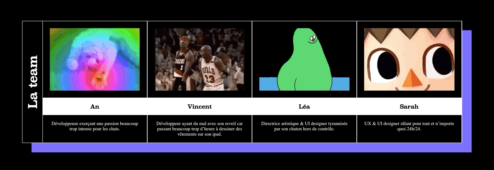

# EX NIHILO :alien:

_**The answer is out there.**_

---

 

  

 

---

 

    

 

    Si vous trouviez un téléphone abandonné...
     
    Quel secret pourriez-vous découvrir ?
     
    Et si la réponse à vos questions était autre part ?
     
     
    <a href="https://exnihilo.netlify.app" target="__blank"><b>___Android APK Download___</b></a>

 

---

## RELEASES

| Version |                                Download Link                                |             Notes              |
| :-----: | :-------------------------------------------------------------------------: | :----------------------------: |
|  1.0.0  |     [APK](https://www.dropbox.com/s/q0i4wyfems1odu4/ex-nihilo.apk?dl=0)     | Maybe this is v1.0.0 :flushed: |
|  1.1.0  | [APK](https://www.dropbox.com/s/1cg9jbcs63n8yl6/ex-nihilo-1.1.0.0.apk?dl=0) |       Dataviz enhanced.        |
|  1.1.5  | [APK](https://www.dropbox.com/s/zp2zxpsa2dy0mrp/ex-nihilo-1.1.5.0.apk?dl=0) |   FullScreen support added.    |

## Authors

    

- [**Sarah Manzaro**](htts://) @ Gobelins - Designer.
- [**Léa Morand**](htts://) @ Gobelins - Designer.
- [**sdsmnc**](https://github.com/sdsmnc221) / [**An TRUONG**](https://antr.tech) @ Gobelins - Developer.
- [**VincentLrg**](https://github.com/VincentLrg) / [**Vincent Largillet**](https://www.vincentlargillet.fr/) @ Gobelins - Developer.

 

## Acknowledgments

- [**Gobelins - L'Ecole de l'Image**](https://www.gobelins.fr/).
- [**Gobelins - Interactive Design**](http://designinteractif.gobelins.fr/).
- [**COVID19 social distance**](https://dev.to/search?q=covid19) :alien:.
